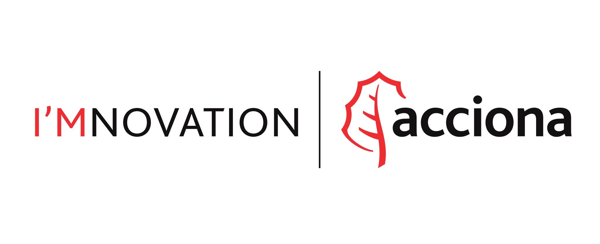

# Acciona Magic Leap Utils

Hi there!

We are the Advanced and Digital Innovation Hub team from Acciona S.A., Spain. Here, at the Mixed Reality Skill Center, we have been working with the Magic Leap device for a while. On the process we have developed some useful tools for Unity that we really wanted to share with the community.

# Project setup

This project was made with Unity 2018.1.9f2-MLTP10. You can download the Technical Preview [here](https://unity3d.com/es/partners/magicleap). Clone or download the repository and open AccionaMLUtils folder with Unity.

After opening the project you will need to import the Magic Leap Unity package. Current version of this project was made using MLSDK v0.19.0. Since Magic Leap is currently under heavy development, future versions of MLSDK may be incompatible.

Once you opened the project with a Unity Editor version that is compatible with Magic Leap and imported a compatible MLSDK version, you can check the example scenes and documentation under AccionaMLUtils/Examples assets folder.

## Features

* Completelly custom object persistence system builded from the ground up based on MLPersistentCoordinateFrames API. It allows saving multiple binding configurations for the same scene, in addition to more control over the binding behaviour of persistent objects
* Utility component to expose 6DOF controller input in a more familiar way for Unity developers. Also comes with some extra tools for easely treating the touchpad as a D-Pad controller.
* Unity's Input System adaptation to make the 6DOF controller behave like a mouse when interacting with world space canvas. It's full compatible with all Unity's built-in canvas input interactions. With this feature you will be able to freely create a floating menu without the need to manually code input interaction from the controller.

## Notes

Please keep in mind that we may update this utilities from time to time, but don't have any plan to do it regularly. We hope these tools can help developers to create awesome experiences with Magic Leap and Unity.

## License

[MIT License](LICENSE)

# Contact

We can't guarantee any support for this project, but in case you want to contact us, please write an e-mail to <pagutierrezm.ext@acciona.com>